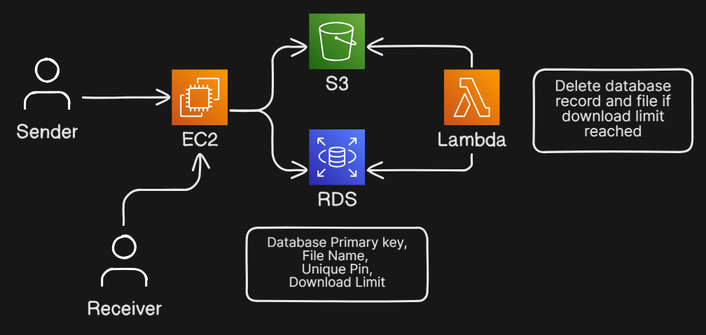

<h1 align="center" style="display: flex; align-items: center; justify-content: center; gap: 10px;">
  
  Zippy - Cloud Based File Sharing
</h1>

A simple and secure anonymous file-sharing platform where users can upload files without login, and share them via a 4-digit PIN. Designed to be lightweight and privacy-focused.

---

## 🚀 Features

- ✅ Anonymous Upload — No login or registration required
- 📁 Unique 4-digit PIN generation per file
- 🔐 Files stored securely on **AWS S3**
- ⏳ Limited download count per file (self-destruct feature)
- 🧹 Auto-cleanup: When a file's download limit reaches 0, it is deleted from both **S3** and **RDS**
- 📦 Simple architecture using **EC2**, **RDS**, and **S3**

---

## 📐 Architecture Overview

---

## 🛠️ Tech Stack

- **Frontend**: Simple HTML , CSS & Js
- **Backend**: Java (Spring Boot)
- **Database**: Amazon RDS (MySQL)
- **Storage**: Amazon S3
- **Hosting**: Amazon EC2
- **Scheduler**: Amazon Lambda

---

## 📤 Upload Workflow

1. User uploads a file via the `/upload` API.
2. Server:
   - Provides a **pre-signed URL** to securely upload the file directly to S3
   - Generates a unique 4-digit PIN
   - Stores metadata in RDS (including the S3 key and download limit)
3. User uploads the file using the pre-signed URL
4. The PIN is returned to the user for sharing

---

## 📥 Download Workflow

1. User enters the 4-digit PIN at the `/download` API
2. Server:
   - Validates the PIN and checks if the file exists and download count > 0
   - Generates a **pre-signed URL** for the file download
   - Decrements the download count in RDS
3. User receives the pre-signed URL and downloads the file directly from S3
4. If download count reaches 0, the file becomes inaccessible
